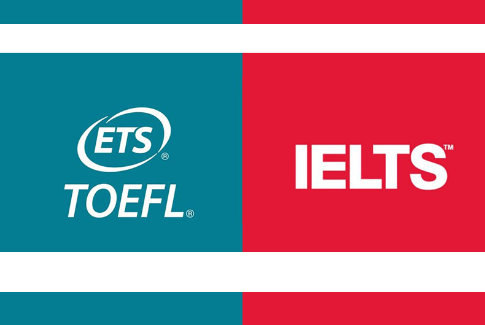
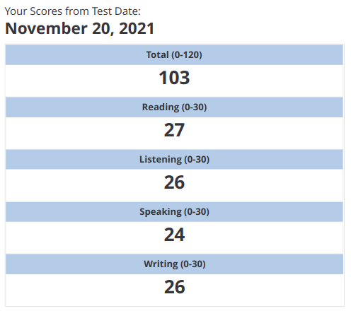

سلام. گفتم یه سری تجربیاتی که در آزمون تافل بدست آوردم رو طبق روال معمول یه جا مکتوب کنم. قبلش بگم تعداد زیادی تجربه عالی در کانال [پرگار تافل](https://t.me/pargartoefl) وجود داره که من هم استفاده کردم.

البته اینها نظرات شخصی یک آماتور (بنده) هست و اعتبار خاصی نداره. من عادت دارم نظراتم رو صریح بگم.

این نمره من هست که به نظرم با وقتی که گذاشتم، بد نیست.

نمره آزمون تافل من

### چرا تافل، چرا ایلتس؟

به نظر من تافل یا ایلتس دادن بیشتر به اطرافیان آدم بستگی داره. تو دانشگاه ما، اکثر دوستان تافل میدادن که من اگر میخواستم ایلتس بدم دیگه نمیتونستم با اون ها مشارکت کنم. رایتینگ تافل و ایلتس فرق داره همین طور اسپیک و بقیه تسک ها و حتی برین استورم. مشارکت گروهی تو آزمون هم به نظرم خیلی خیلی مهمه. بالاخره نمیشه که همه اسپیکینگ ها یا رایتینگ هاتون رو بدید تصحیح کنند. اگر با ۲ نفر دیگه هم گروه باشید که بتونید از هم فیدبک بگیرید خیلی بهتر میشه. بعدشم منابع هر آزمون تقریبا فرق داره.

اینم بگم اگر کسی زبانش خیلی ضعیفه. باید بره اول کلی رو پایه زبان انگلیسی اش کار کنه. تافل رو برای یه کسی که یه پایه متوسط به بالا داره میشه تو ۲ ۳ ماه کلا جمع کرد. اگر میخواید بفهمید در چه سطحی هستید یه TPO بزنید اگر مهارت ریدینگ لیستینگ تون تقریبا بالای ۲۰ بود یعنی اوکیه.

تافل بیشتر مهارت آزمون دادنه تا تست درستی برای سنجش مهارت انگلیسی. مثلا این که شما بتونید تو تسک اسپیک خیلی خوب صحبت کنید فقط به مهارت اسپینگ تون بستگی نداره. به این هم بستگی داره که اگر یکی داشت کنار گوشتون عربده میکشید (مثل آزمون من) بتونید کنترل کنید و درست صحبت کنید.  

پیش زمینه زبان انگلیسی من: کانون زبان ایران رو تا advanced رفته بودم و یه ترم هم زبان تدریس میکردم.

ماک هم حتما ثبت نام کنید. میگن نمره ماک خیلی شبیه به نمره اصلی میشه.

نیازی به دانلود پکیج کامل برای TPO زدن نیست. یه سایت [testhelper](https://toefl.testhelper.ir/) هست که استفاده میکنید. خیلی هم به آزمون اصلی که میدید شبیه هست.

گرامرلی که یه چیز متداول هست. البته خیلی کار خاصی انجام نمیده، بعد چند وقت پیشنهاداتش رو حفظ میشید و دیگه خودتون اعمال میکنید ولی به نظرم نسبت به قیمتش میارزه. من از سایت [گرامرلی امیرکبیر](https://autgrammarly.ir/) خریدم. روالش هم اینه که بعد از این که پرداخت رو انجام دادید، یه ایمیل از سمت گرامرلی براتون میاد که میگه تیم امیرکبیر شما رو به organization اش دعوت کرده و اینجوری اکانت پریمیوم گرامرلی با تمام امکانات روی ایمیلتون فعال میشه.

به نظرم بهتر از گرامرلی سایت [wordtune](https://www.wordtune.com/) هست که البته افزونه هم داره. بهش یکی دو جمله میدید و براتون بازنویسی یا پارافریز میکنه. خیلی فواید داره مثلا میتونید اینجوری تمپلت هایی که از تو رایت و اسپیک میبنید رو کامل شخصی سازی کنید. جملات رایتنیگ تون رو هم میتونید بهش بدید و پیشنهادهای خیلی خوبی میده. یکی از دوستان میگفت زندگی من به قبل از اشنایی با وردتون و بعدآشنایی اش تقسیم میشه. برای SOP نوشتن هم خیلی خوبه.

فقط تو پرانتز بگم فعلا روزی ۲۰ تا عبارت رو بازنویسی نمیکنه که میتونید برای دورزدنش با حالت private مرورگرتون سایت رو باز کنید و استفاده کنید و هر وقت تموم شد سایت رو ببندید دوباره باز کنید (قاعدتا تو حالت نصب افزونه نمیشه همچین کاری کرد).

تو این مسیر با یه سری اصطلاحات مداوم برخورد داشتم که بد نیست مکتوب کنم:

۱- ژنتی (Zhenti): یک سری ریندینگ و لیستینگ هستن که از موسسه ETS (که تافل رو برگزار میکنه) هک شدند. ظاهرا دوستان و برادران چینی ما این کار رو انجام دادند. حتی ممکنه تو امتحانتون یه ریندینگ از ژنتی باشه. البته ممکنه ریندینگ از TPO ها هم باشه (دقیقا یه ریندینگ من عین TPO بود).

۲- پردیشکن ژان (Zhan Prediction): یک سری سوال درباره تسک های independent (تسک ۱ اسپیک و ۲ رایت) هستند که احتمال این که بیاد هست. خیلی خوبه اینها رو با خودتون brainstorm کنید. بهترین راهش هم به نظر من اینه که یه گروهی پیدا کنید چند وقت یه بار یه جلسه تو گوگل میت یا هر جایی برگزار کنید و با هم برین استورم کنید. دلایلش هم از تقریبا همگی تکرارین که میتونید از فایل دلایل طلایی استفاده کنید.

کتاب خادم (TOEFL Writing Success 6th) رو هم من گرفتم. به نظرم ریدینگ هاش همون طور که اولش گفته شده خیلی غیرمنطقی نوشته شده. بله من اگر ۴۵ دقیقه الی یک ساعت وقت داشتم میتونستم همچین چیزی رو بنویسم ولی تو مدت ۳۰ دقیقه به هیچ وجه. مشکل اصلی از تمپلتش هست که ادم براش بد جا میفته. یعنی به جای این که خیلی ساده یه مثال شخصی بزنه و پاراگراف رو جمع بندی کنه، میاد اکثرا روی fact مانور میده. نه که فکت نوشتن بد باشه. فقط این که به نظرم تو تایم آزمون نمیشه این همه فکت ارائه داد. رایتینگ رو میشه خیلی ساده تر نوشت.

جدای از این مشتی کتاب لغت و غیره گرفتم که به نظرم همشون به درد نخورن. من حتی ۴۰۰۰ و ۱۲۱۲ و لغت های TPO که بچه ها بصورت انکی و ممرایز میخونن رو شروع کردم که بخونم و چند وقتی کار کردم ولی به نظرم اومد خیلی کار عبثی هست و ولش کردم. چرا؟ چون اینجوری لغت خوندن بازدهی خاصی نداره. تو رایتنینگ و اسپیکینگ که نمیتونید ازش استفاده کنید چون احتمال خیلی زیاد لغت بصورت active در ذهنتون جا نگرفته و صرفا بصورت passive معنی اش رو بلدید. تو لیستینگ ریندینگ ممکنه تاثیر داشته باشه که به نظرم یه روش دیگه مفید تره.

میدونید انگار داریم به جای خوندن اصل زبان انگلیسی خودمون رو با یه چیز الکی ساختگی سرگرم میکنیم. کلمه یاد میگیریم که چی؟ که تو جمله بتونیم معنی اش رو بفهمیم. اگر هدف این هست خیلی بهتره من وقت بذارم ریدینگ های ژنتی رو بخونم و سعی کنم از داخل متن لغات رو حدس بزنم. حدس زدن لغت تو کانتکس خیلی منطقی تره. اینجوری ذهن آدم هم تقویت میشه برای آزمون که یه لغتی رو نفهمیدید کپ نکنید. همچنین وقتی یه لغت رو تو متن های مختلف میبنید بطور ناخودآگاه با کاربردهای مختلفش آشنا میشید و کم کم میاد به حافظه active تون. یه جا دیدم ۱۷ بار مواجهه با یه لغت تو کانتکست های مختلف لازمه تا یه نفر یه لغت رو کامل یاد بگیره. برای لیستینگ هم همین طور.

البته اینی که میگم از خوندن لغت با انکی و ممرایز سخت تره! امتحان کنید. یه ساعت انکی بزنید بعد برید یک ساعت یه ریدینگ بخونید ببینید کدوم ذهنتون رو بیشتر درگیر کرد و واقعا حس کردید که یه چیز یاد گرفتید.

آقای [سعید رضایی](https://www.instagram.com/saeedrezaee_1360/) در پیج ایسنتاگرامشون به خوبی این مطلب رو توضیح دادن. به نظرم در مورد گرامرخوندن هم بسیار درست گفتند. ما سالها تو کانون زبان پیچیده ترین گرامرهای انگلیسی رو یاد گرفتیم اما وقتی به رایتینگ رسیدم دیدم برای نوشتن جملات مشکل دارم. گرامر هم باید در context یاد گرفته بشه و البته زیاد استفاده بشه تا جا بیفته. نه این که کتاب گرامر رو دست بگیریم و شروع کنیم به یکی یکی گرامرخوندن. (این کاری هست که من قبلا انجام دادم و به نظرم خیلی مفید نبوده)

درباره ریدینگ بگم که بهترین چیزی که خوندم یه کتاب هست به نام mastering the reading section که واقعا عالیه برای این که تکنیک حل هر سوال دستتون بیاد. این که میگم تافل تکنیک هست به این خاطر میگم.

من فقط یه جلسه از اقای مستر ایکس عزیز مشاوره گرفتم و فهمیدم روش ایشون در نوشتن تسک رایتینگ چقدر درست و حرفه ای هست. واقعا لذت بردم از مکالمه با ایشون.

ایشون یک روش جالب در دولوپ کردن پاراگراف دارند که شما میتونید رایتینگ های تو کانالشون رو بخونید که متوجه بشید چطوری میگم.

مثال بزنم از یکی از رایتینگ هایی که به نظر خودم تا حدی به حرفشون نزدیک هست.

  

  

یک سری منبع پیشنهاد بدم برای مطالعه و تقویت زبان که مشخصا مرتبط به تافل هم میشه

[کانال کرش کورش](https://www.youtube.com/channel/UCX6b17PVsYBQ0ip5gyeme-Q)

ویدئو های کوتاه و مفید داره که کلا زبانتون رو تقویت میکنه.

کانال رایتینگ مسترایکس

سمپل های خیلی خوب و مفیدی داره

کانال رایتینگ افشین

اصطلاحات مفیدی رو یاد میده

#### ریدینگ تافل

ریندینگ تافل اکادمیک مشخصا متن یه سری کتاب اکادمیک هست تو زمینه های مختلف. (البته جالب اینکه متن کامپیوتری توش نیست). فکر کنید مثلا دارید کتاب زیست شناسی یا شیمی یا زمین شناسی یا تاریخ دبیرستان رو به زبان انگلیسی میخونید. همچین چیزی رو انتظار دارند که بفهمید. قرار هم نیست همه لغت ها رو بلد باشید قطعا میخوان مهارت حدس زدن لغت از روی کانتکس رو هم بفهمن. پس من خیلی ژنتی یا TPO یا سایت های مختلف رو پیشنهاد میکنم.

لیسیتینگ تافل

ژنتی

اسپیکینگ تافل

پردیشکن های ژان خیلی خوبن

رایتینگ

پردیشکن های ژان +TPO + تصحیح های مسترایکس

خب من چیکار کردم؟ من ۲ ۳ تا ژنتی بیشتر نزدم ولی پردیشکن ها رو تقریبا همگی رو کار کردم.